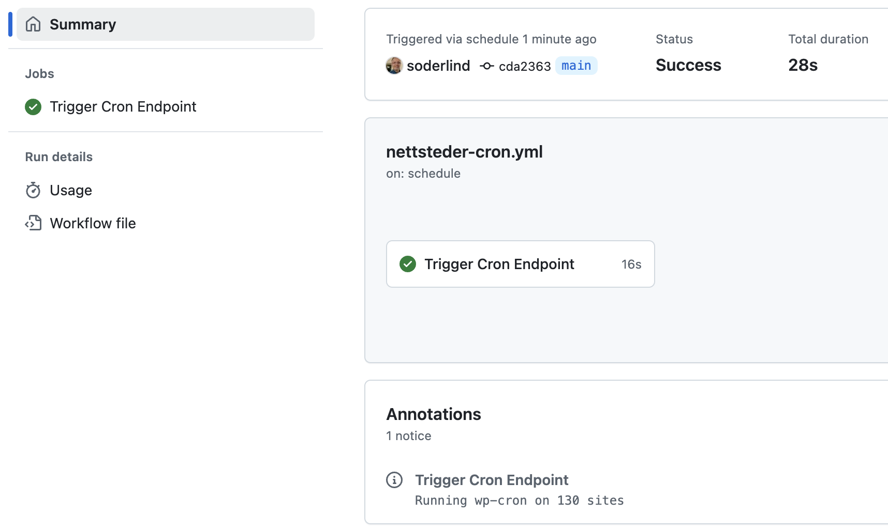

# DSS Cron

Run wp-cron on all public sites in a multisite network

> You could have done this with a simple cron job. Why use this plugin? I have a cluster of WordPress sites. I did run a shell script calling wp cli, but the race condition was a problem. I needed a way to run wp-cron on all sites without overlapping. This plugin was created to solve that problem.

## 🚀 Quick Start

1. Upload `dss-cron` to `/wp-content/plugins/`
2. Network activate via 'Network->Plugins'
3. Disable WordPress default cron in `wp-config.php`:
   ```php
   define('DISABLE_WP_CRON', true);
   ```

## 🔧 Configuration

The plugin creates an endpoint at /dss-cron that triggers cron jobs across your network.

Usage: `https://example.com/dss-cron`

Adding ?ga to the URL (e.g., `https://example.com/dss-cron?ga`) will output results in GitHub Actions compatible format:

- Success: `::notice::Running wp-cron on X sites`
- Error: `::error::Error message`

  Example GitHub Action success notice:

  

## Trigger Options

1. System Crontab (every 5 minutes):

```bash
*/5 * * * * curl -s https://example.com/dss-cron
```

2. GitHub Actions (every 5 minutes):

```yaml
name: DSS Cron Job
on:
  schedule:
    - cron: '*/5 * * * *'

env:
  CRON_ENDPOINT: 'https://example/dss-cron/?ga'

jobs:
  trigger_cron:
    runs-on: ubuntu-latest
    timeout-minutes: 5
    steps:
      - run: |
          curl -X GET ${{ env.CRON_ENDPOINT }} \
            --connect-timeout 10 \
            --max-time 30 \
            --retry 3 \
            --retry-delay 5 \
            --silent \
            --show-error \
            --fail
```

## Customization

Adjust maximum sites processed per request (default: 200):

```php
add_filter('dss_cron_number_of_sites', function($sites_per_request) {
	return 200;
});
```

Adjust transient expiration time (default: 1 hour):

```php
add_filter('dss_cron_transient_expiration', function($expiration) {
	return HOUR_IN_SECONDS;
});
```

## ⚙️ Changelog

### 1.0.12

- Refactor error message handling

### 1.0.11

- Maintenance update

### 1.0.10

- Added GitHub Actions output format when using ?ga parameter

### 1.0.9

- Add sites caching using transients to improve performance.

### 1.0.8

- Update documentation.

### 1.0.7

- Set the number of sites to 200. You can use the `add_filter( 'dss_cron_number_of_sites', function() { return 100; } );` to change the number of sites per request.

### 1.0.6

- Make plugin faster by using `$site->__get( 'siteurl' )` instead of `get_site_url( $site->blog_id )`. This prevents use of `switch_to_blog()` and `restore_current_blog()` functions. They are expensive and slow down the plugin.
- For `wp_remote_get`, set `blocking` to `false`. This will allow the request to be non-blocking and not wait for the response.
- For `wp_remote_get`, set `sslverify` to `false`. This will allow the request to be non-blocking and not wait for the response.

### 1.0.5

- Update composer.json with metadata

### 1.0.4

- Add namespace
- Tested up to WordPress 6.7
- Updated plugin description with license information.

### 1.0.3

- Fixed version compatibility

### 1.0.2

- Updated plugin description and tested up to version.

### 1.0.1

- Initial release.

## Copyright and License

DSS Cron is copyright 2024 Per Soderlind

DSS Cron is free software: you can redistribute it and/or modify it under the terms of the GNU General Public License as published by the Free Software Foundation, either version 2 of the License, or (at your option) any later version.

DSS Cron is distributed in the hope that it will be useful, but WITHOUT ANY WARRANTY; without even the implied warranty of MERCHANTABILITY or FITNESS FOR A PARTICULAR PURPOSE. See the GNU General Public License for more details.

You should have received a copy of the GNU Lesser General Public License along with the Extension. If not, see http://www.gnu.org/licenses/.
