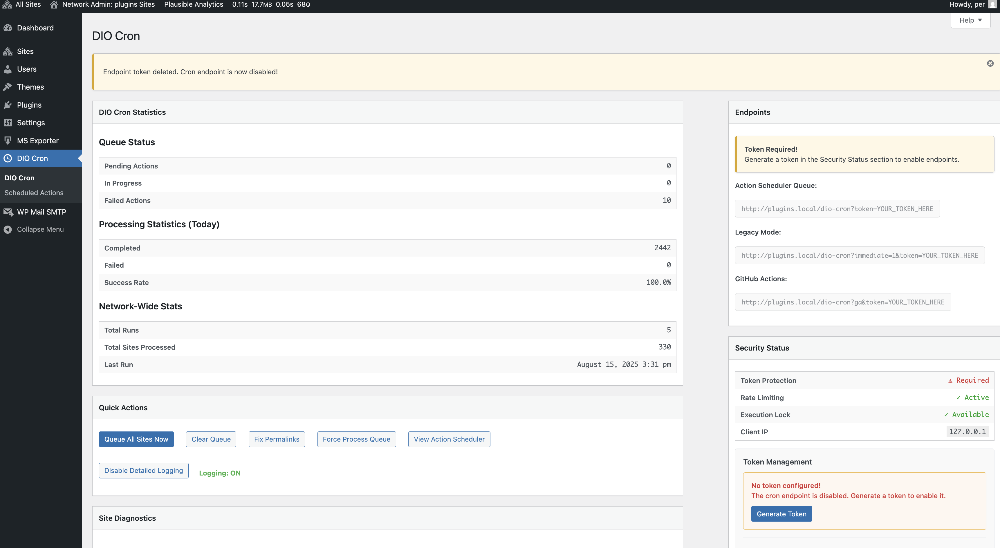

# DIO Cron

Run cron jobs on all sites in a WordPress multisite network. Uses **Action Scheduler** for better reliability and performance.

> "Why not just use a simple cron job?" I run a cluster of WordPress sites and tried using shell scripts with WP-CLI, but ran into race condition problems. I needed a way to run cron jobs on all sites without them overlapping. This plugin solves that problem.




## What It Does

DIO Cron triggers WordPress cron jobs across all public sites in your multisite network through external endpoints. Instead of each site running its own cron independently, this plugin coordinates everything from one place using Action Scheduler for reliable queue-based processing.

**Key Benefits:**
- No race conditions or overlapping cron jobs
- External trigger architecture for better reliability
- Queue-based processing with built-in retry logic
- Comprehensive admin interface with enhanced monitoring
- Built-in security with token authentication and rate limiting
- **Performance optimized** for large multisite networks
- **Enhanced error handling** and recovery mechanisms

## Quick Setup

- **Quick Install**

   - Download [`dio-cron.zip`](https://github.com/soderlind/dio-cron/releases/latest/download/dio-cron.zip)
   - Upload via  Network > Plugins > Add New > Upload Plugin
   - Activate the plugin.
   - Go to **Network Admin → DIO Cron** to manage everything
   -  **Generate a security token** in the Security Status panel
   - Disable WordPress default cron in `wp-config.php`:
   ```php
   define( 'DISABLE_WP_CRON', true );
   ```

- **Composer Install**

   ```bash
   composer require soderlind/dio-cron
   ```

- **Updates**
   * Plugin updates are handled automatically via GitHub. No need to manually download and install updates.


**Requirements:**
- WordPress Multisite
- Super Admin access
- Action Scheduler 3.8+ plugin installed and active
- Plugin Update Checker 5.0+ (bundled)

## How to Use It

### Admin Interface
Go to **Network Admin → DIO Cron** to:
- **Generate and manage security tokens** for endpoint protection
- View comprehensive statistics: queue status, processing metrics, and network-wide stats
- Manually trigger cron jobs for all sites with real-time feedback
- Test individual sites for connectivity issues
- Monitor security status with rate limiting and execution locks
- Access enhanced help system with detailed troubleshooting guidance

### Automatic Triggers
Set up one of these external systems to trigger DIO Cron automatically. **Note: All endpoints require a security token.**

**1. External Monitoring (Recommended)**
Services like Pingdom, UptimeRobot, or monitoring tools can ping your site every few minutes:
- `https://yoursite.com/dio-cron?token=your-token-here`
- **Extra benefit:** You get notifications if the site is down

**2. Server Cron Job**
Add this to your server's crontab (every 5 minutes):
```bash
*/5 * * * * curl -s "https://yoursite.com/dio-cron?token=your-token-here"
```

**3. GitHub Actions**
Create a workflow file for CI/CD integration:
```yaml
name: DIO Cron
on:
  schedule:
    - cron: '*/5 * * * *'
env:
  DIO_CRON_TOKEN: ${{ secrets.DIO_CRON_TOKEN }}
jobs:
  trigger:
    runs-on: ubuntu-latest
    steps:
      - run: curl -s "https://yoursite.com/dio-cron?ga&token=${{ env.DIO_CRON_TOKEN }}"
```

**Why External Triggers?**
DIO Cron is designed to be triggered by external systems rather than self-scheduling. This approach provides:
- Better reliability and predictable timing
- Integration with monitoring and alerting systems
- Reduced server load from internal scheduling overhead
- Clear separation between scheduling and execution

### Available Endpoints
**All endpoints require a `?token=your-token-here` parameter:**
- **`/dio-cron?token=TOKEN`** - Queue jobs for processing (recommended)
- **`/dio-cron?immediate=1&token=TOKEN`** - Process all sites right away
- **`/dio-cron?ga&token=TOKEN`** - Output in GitHub Actions format

## Security

### Token Authentication
DIO Cron requires a security token for all endpoint access. This prevents unauthorized access and abuse.

**Generate Token:**
1. Go to **Network Admin → DIO Cron**
2. In the Security Status panel, click **"Generate Token"**
3. Copy the generated token
4. Add `?token=your-token-here` to all your cron URLs

**Token Management:**
- **Generate New Token** - Creates a secure random token
- **Set Custom Token** - Use your own token (minimum 16 characters)
- **Delete Token** - Removes token and disables endpoint

**Security Features:**
- **Rate Limiting** - Maximum 5 requests per 5 minutes per IP
- **Execution Locking** - Prevents concurrent cron runs
- **Security Logging** - All access attempts are logged
- **IP Tracking** - Monitor requests by IP address

**Alternative Token Configuration:**
You can also set tokens via environment variables or WordPress constants:
```bash
# Environment Variable
export DIO_CRON_TOKEN="your-secure-token-here"
```
```php
// WordPress Constant (wp-config.php)
define( 'DIO_CRON_TOKEN', 'your-secure-token-here' );
```

## Configuration

### External Trigger Setup
DIO Cron is designed to work with external schedulers. Choose the frequency that works best for your network:
- **Every 5 minutes** - For time-sensitive applications
- **Every 15-30 minutes** - Good balance for most sites  
- **Every hour** - For stable sites with minimal updates
- **Every 6-12 hours** - For maintenance and cleanup tasks

### Admin Interface Features
The Network Admin interface provides:
- **Real-time Statistics**: Queue status, processing metrics, and network-wide statistics
- **Site Diagnostics**: Test individual sites for connectivity and cron execution
- **Token Management**: Secure endpoint authentication with easy token generation
- **Enhanced Help System**: Comprehensive contextual help with troubleshooting guidance
- **Action Integration**: Direct access to Action Scheduler for detailed job monitoring

### Customization
Adjust how many sites to process at once:
```php
add_filter( 'dio_cron_number_of_sites', function( $count ) {
    return 100; // Default is 200
});
```

Change request timeout:
```php
add_filter( 'dio_cron_request_timeout', function( $seconds ) {
    return 10; // Default is 15 seconds
});
```

Customize HTTP request arguments:
```php
add_filter( 'dio_cron_request_args', function( $args, $site_url ) {
    // Add custom headers or modify request parameters
    $args['headers']['X-Custom-Header'] = 'DIO-Cron-Request';
    return $args;
}, 10, 2 );
```

Adjust cache duration (using WordPress time constants):
```php
add_filter( 'dio_cron_sites_transient', function( $duration ) {
    return 2 * HOUR_IN_SECONDS; // Cache for 2 hours instead of 1
});
```

Configure rate limiting (using WordPress time constants):
```php
add_filter( 'dio_cron_rate_limit_max_requests', function( $max ) {
    return 10; // Allow 10 requests instead of 5
});

add_filter( 'dio_cron_rate_limit_time_window', function( $seconds ) {
    return 10 * MINUTE_IN_SECONDS; // 10 minute window instead of 5
});
```

Customize Action Scheduler batch size:
```php
add_filter( 'dio_cron_batch_size', function( $size ) {
    return 50; // Process 50 sites per batch instead of 25
});
```

**WordPress Time Constants:**
DIO Cron uses WordPress time constants for better code readability and maintainability:
- `MINUTE_IN_SECONDS` (60 seconds)
- `HOUR_IN_SECONDS` (3600 seconds) 
- `DAY_IN_SECONDS` (86400 seconds)
- `WEEK_IN_SECONDS` (604800 seconds)
- `MONTH_IN_SECONDS` (2592000 seconds)
- `YEAR_IN_SECONDS` (31536000 seconds)

These constants make timing configurations more readable and prevent calculation errors.

### Available Action Hooks

Monitor individual site processing:
```php
add_action( 'dio_cron_site_processed', function( $site_id, $site_url, $result ) {
    if ( is_wp_error( $result ) ) {
        error_log( "DIO Cron failed for site {$site_id}: " . $result->get_error_message() );
    } else {
        error_log( "DIO Cron completed for site {$site_id}" );
    }
}, 10, 3 );
```

## Troubleshooting

### Authentication Issues
**Getting 401 Unauthorized?**
- Check that you've included `?token=your-token-here` in your URL
- Verify the token is correct in **Network Admin → DIO Cron → Security Status**
- Generate a new token if needed

**Getting 429 Too Many Requests?**
- You're hitting the rate limit (5 requests per 5 minutes)
- Wait a few minutes and try again
- Check if multiple systems are calling the endpoint

### WordPress Cron Warning
If you see a warning about `DISABLE_WP_CRON`, add this to your `wp-config.php`:
```php
define( 'DISABLE_WP_CRON', true );
```
This prevents conflicts between WordPress cron and DIO Cron.

### Endpoint Not Working
If `/dio-cron` returns a 404 error:
1. Go to **Network Admin → DIO Cron** and click "Fix Permalinks"
2. Or visit **Settings → Permalinks** and click "Save Changes"

### Concurrent Execution
**Getting 409 Conflict?**
- Another cron job is already running
- Wait up to 5 minutes for it to complete
- Check **Tools → Scheduled Actions** for stuck jobs

### Check What's Happening
- View detailed logs at **Tools → Scheduled Actions**
- Filter by group: `dio-cron`
- See which jobs succeeded or failed
- Check security logs in WordPress debug log

### Debugging and Logging
**Development Environment Only:**
DIO Cron includes detailed logging for debugging wp-cron triggers, but this feature is only available when `WP_DEBUG` is enabled for security.

**Enable Debug Logging:**
1. Add to your `wp-config.php`:
   ```php
   define( 'WP_DEBUG', true );
   define( 'WP_DEBUG_LOG', true );
   ```
2. Go to **Network Admin → DIO Cron**
3. Use the "Enable Detailed Logging" button in Quick Actions
4. Check `/wp-content/debug.log` for detailed request logs

**Security Note:**
- Logging controls are automatically hidden in production (`WP_DEBUG = false`)
- No debugging information is logged without explicit debug mode activation
- Protects against accidental logging in live environments

## Performance Optimizations

### Large Network Support
**Version 2.2.11** includes enhanced Action Scheduler conflict prevention:

- **🛡️ Comprehensive Conflict Prevention**: Multi-level checks to prevent Action Scheduler function redeclaration errors
- **📋 ActionScheduler_Versions Detection**: Smart detection of existing Action Scheduler installations by other plugins
- **🔧 Enhanced Plugin Coexistence**: Improved compatibility in complex multi-plugin environments
- **⚡ Robust Loading Strategy**: Intelligent loading that respects Action Scheduler's version registry system
- **🔧 Action Scheduler Conflict Resolution**: Fixed fatal errors when multiple plugins include Action Scheduler (from 2.2.10)
- **🛡️ Enhanced Plugin Compatibility**: Smart detection prevents function redeclaration conflicts (from 2.2.10)
- **⚡ Multi-Plugin Environment Support**: Works seamlessly with other Action Scheduler-dependent plugins (from 2.2.10)
- **🔍 Defensive Programming**: Comprehensive checks for existing Action Scheduler installations (from 2.2.10)
- **Critical Bug Fix**: Fixed ActionScheduler::init() fatal error during plugin activation (from 2.2.9)
- **Error Prevention**: Comprehensive code audit to prevent similar function call issues (from 2.2.9)
- **Enhanced Reliability**: Improved Action Scheduler integration stability (from 2.2.9)
- **Memory Optimization**: Enhanced memory usage for processing hundreds of sites (from 2.2.8)
- **Timeout Protection**: Better handling of long-running operations with safeguards (from 2.2.8)
- **Queue Efficiency**: Improved Action Scheduler integration for faster processing (from 2.2.8)
- **Error Recovery**: Enhanced resilience with better error handling and recovery (from 2.2.8)

### Scalability Features
- **Batch Processing**: Sites are processed in optimized batches for better performance
- **Background Operations**: Heavy operations moved to background processing
- **Resource Management**: Improved resource allocation and cleanup
- **Configuration Tuning**: Optimized default settings for various network sizes

### Performance Monitoring
Monitor performance through the admin interface:
- Queue processing speed and efficiency
- Memory usage during operations
- Error rates and recovery statistics
- Overall network processing metrics

## Monitoring

**Action Scheduler Integration:**
WordPress includes a detailed view at **Network Admin → DIO Cron → Scheduled Actions** where you can:
- See every job that ran with timestamps and status
- Check error messages for failed jobs with detailed logging
- Retry failed jobs manually
- Monitor queue performance and processing times

**Enhanced Admin Experience:**
- **Contextual Help**: Four comprehensive help tabs (Overview, Queue & Processing, Endpoints & Security, Troubleshooting)
- **Persistent Notices**: Admin actions provide clear feedback that survives page redirects
- **Error Handling**: Robust error reporting with user-friendly messages
- **Security Integration**: Real-time security status and token management interface

## Migration from Legacy Version

The plugin works with existing setups. No changes needed.

To gradually switch to the new system:
1. Test the new `/dio-cron` endpoint
2. Compare results with your current setup
3. Update your external triggers when ready
4. Keep `?immediate=1` as a backup option

## License

DIO Cron is free software under the GPL v2 license.

Copyright 2024-2025 Per Soderlind
